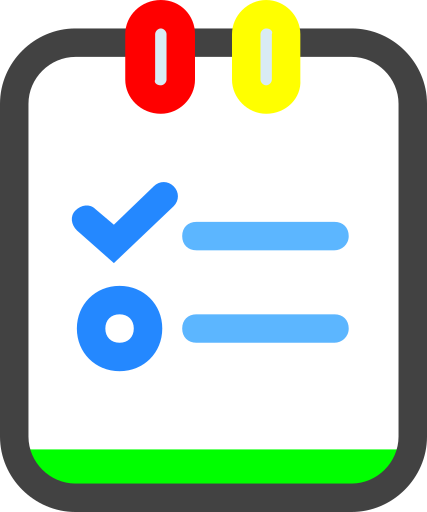
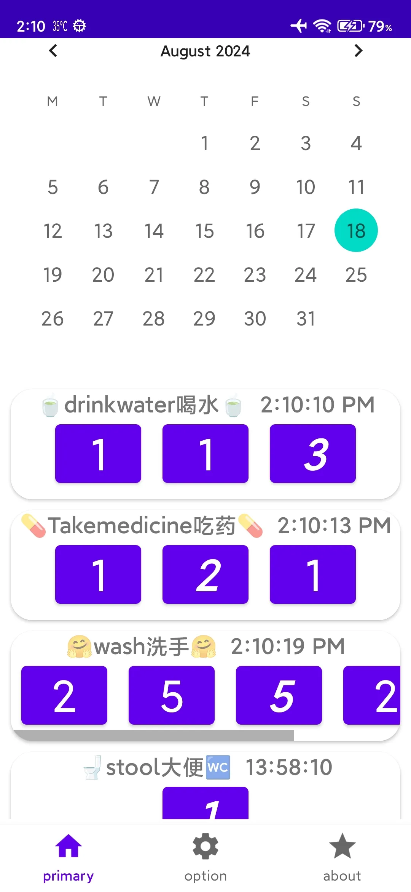

记录今天做了(RecordTodayDid)是免费app,帮助你记忆最近做了的事情,并想起将来的计划任务.你只要简单点一下就可以标记刚才喝水,吃药,洗手,大便,会议等过程

記錄今天做了(RecordTodayDid)是免費app,説明你記憶最近做了的事情,並想起將來的計劃任務.你只要簡單點一下就可以標記剛才喝水,吃藥,洗手,大便,會議等過程

RecordTodayDid is a free app that helps you remember what you've done recently and remember future planned tasks. With a simple click, you can mark the process of drinking water, taking medicine, washing your hands, pooping, meeting, etc

RecordTodayDid est une application gratuite qui vous aide à vous souvenir de ce que vous avez fait récemment et à vous souvenir des futures tâches prévues. D’un simple clic, vous pouvez marquer le processus de boire de l’eau, de prendre des médicaments, de se laver les mains, de faire caca, de se rencontrer, etc

RecordTodayDid ist eine kostenlose App, die Ihnen hilft, sich daran zu erinnern, was Sie in letzter Zeit getan haben, und sich an zukünftige geplante Aufgaben zu erinnern. Mit einem einfachen Klick können Sie den Prozess des Wassertrinkens, der Einnahme von Medikamenten, des Händewaschens, des, des Treffens usw. markieren

Το RecordTodayDid είναι μια δωρεάν εφαρμογή που σας βοηθά να θυμάστε τι έχετε κάνει πρόσφατα και να θυμάστε μελλοντικές προγραμματισμένες εργασίες. Με ένα απλό κλικ, μπορείτε να επισημάνετε τη διαδικασία του πόσιμου νερού, της λήψης φαρμάκων, του πλυσίματος των χεριών σας, της σκασίματος, της συνάντησης κλπ

RecordTodayDid è un'app gratuita che ti aiuta a ricordare ciò che hai fatto di recente e a ricordare le attività pianificate future. Con un semplice clic, puoi segnare il processo di bere acqua, prendere medicine, lavarsi le mani, fare la cacca, incontrarsi, ecc

RecordTodayDidは、最近行ったことを思い出し、将来計画したタスクを思い出すのに役立つ無料アプリです。 クリックするだけで、水を飲む、薬を飲む、手を洗う、うんちをする、会議などのプロセスをマークできます

RecordTodayDid는 최근에 한 일을 기억하고 앞으로 계획된 작업을 기억하는 데 도움이 되는 무료 앱입니다. 간단한 클릭으로 물 마시기, 약 먹기, 손 씻기, 똥 싸기, 회의 등의 과정을 표시할 수 있습니다

RecordTodayDid é um aplicativo gratuito que ajuda você a lembrar o que você fez recentemente e lembrar de futuras tarefas planejadas. Com um simples clique, você pode marcar o processo de beber água, tomar remédios, lavar as mãos, fazer cocô, reunião, etc

RecordTodayDid es una aplicación gratuita que te ayuda a recordar lo que has hecho recientemente y recordar las tareas planificadas futuras. Con un simple clic, puede marcar el proceso de beber agua, tomar medicamentos, lavarse las manos, defecar, reunirse, etcétera

RecordTodayDid เป็นแอปฟรีที่ช่วยให้คุณจดจําสิ่งที่คุณทําเมื่อเร็ว ๆ นี้และจดจํางานที่วางแผนไว้ในอนาคต ด้วยการคลิกง่ายๆ คุณสามารถทําเครื่องหมายขั้นตอนการดื่มน้ํา กินยา ล้างมือ อึ ประชุม ฯลฯ

RecordTodayDid là một ứng dụng miễn phí giúp bạn nhớ những gì bạn đã làm gần đây và ghi nhớ các nhiệm vụ được lên kế hoạch trong tương lai. Với một cú nhấp chuột đơn giản, bạn có thể đánh dấu quá trình uống nước, uống thuốc, rửa tay, đi ị, họp, v.v

RecordTodayDid היא אפליקציה חינמית שעוזרת לך לזכור מה עשית לאחרונה ולזכור משימות מתוכננות עתידיות. בלחיצה פשוטה תוכלו לסמן את תהליך שתיית המים, נטילת תרופות, שטיפת ידיים, קקי, פגישה וכו'

RecordTodayDid is een gratis app die je helpt herinneren wat je onlangs hebt gedaan en toekomstige geplande taken te onthouden. Met een simpele klik kunt u het proces van water drinken, medicijnen innemen, handen wassen, poepen, vergaderen, enz. markeren

RecordTodayDid é um aplicativo gratuito que ajuda você a lembrar o que fez recentemente e a lembrar de futuras tarefas planejadas. Com um simples clique, você pode marcar o processo de beber água, tomar remédios, lavar as mãos, fazer cocô, reunião, etc

RecordTodayDid on ilmainen sovellus, jonka avulla voit muistaa, mitä olet tehnyt viime aikoina, ja muistaa tulevat suunnitellut tehtävät. Yhdellä napsautuksella voit merkitä veden juomisen, lääkkeen ottamisen, käsien pesun, kakkaamisen, kokouksen jne

RecordTodayDid, son zamanlarda ne yaptığınızı hatırlamanıza ve gelecekte planlanan görevleri hatırlamanıza yardımcı olan ücretsiz bir uygulamadır. Basit bir tıklama ile su içme, ilaç alma, ellerinizi yıkama, kaka yapma, toplantı vb. işlemleri işaretleyebilirsiniz

RecordTodayDid adalah aplikasi gratis yang membantu Anda mengingat apa yang telah Anda lakukan baru-baru ini dan mengingat tugas yang direncanakan di masa mendatang. Dengan satu klik sederhana, Anda dapat menandai proses minum air, minum obat, mencuci tangan, buang air besar, rapat, dll

RecordTodayDid एक निःशुल्क ऐप है जो आपको यह याद रखने में मदद करता है कि आपने हाल ही में क्या किया है और भविष्य के नियोजित कार्यों को याद रखें। एक साधारण क्लिक के साथ, आप पानी पीने, दवा लेने, अपने हाथ धोने, शौच करने, बैठक आदि की प्रक्रिया को चिह्नित कर सकते हैं

RecordTodayDid ialah aplikasi percuma yang membantu anda mengingati perkara yang telah anda lakukan baru-baru ini dan mengingati tugasan yang dirancang pada masa hadapan. Dengan satu klik mudah, anda boleh menandakan proses air minuman, mengambil ubat, mencuci tangan, buang air besar, mesyuarat, dan lain-lain

RecordTodayDid to bezpłatna aplikacja, która pomaga zapamiętać, co ostatnio zrobiłeś i zapamiętać przyszłe zaplanowane zadania. Za pomocą jednego kliknięcia możesz zaznaczyć proces picia wody, przyjmowania leków, mycia rąk, robienia kupy, spotkania itp

RecordTodayDo هو تطبيق مجاني يساعدك على تذكر ما قمت به مؤخرا وتذكر المهام المخطط لها في المستقبل. بنقرة بسيطة ، يمكنك تحديد عملية شرب الماء ، وتناول الدواء ، وغسل يديك ، والتبرز ، والاجتماع ، وما إلى ذلك

RecordTodayDid är en gratis app som hjälper dig att komma ihåg vad du har gjort nyligen och komma ihåg framtida planerade uppgifter. Med ett enkelt klick kan du markera processen att dricka vatten, ta medicin, tvätta händerna, bajsa, träffas etc

RecordTodayDid – это бесплатное приложение, которое поможет вам вспомнить, что вы делали недавно, и вспомнить о будущих запланированных задачах. Простым нажатием мыши можно отметить процесс питья воды, приема лекарств, мытья рук, депрессирования, встречи и т.д

ریکارڈ کریں کہ آپ نے آج کیا کیا (RecordTodayDid) ایک مفت ایپ ہے جو آپ کو حال ہی میں کیے گئے کاموں کو یاد رکھنے اور مستقبل کے منصوبہ بند کاموں کو یاد رکھنے میں مدد کرتی ہے۔ ایک سادہ کلک کے ساتھ ، آپ پانی پینے ، دوا لینے ، اپنے ہاتھ دھونے ، پوپنگ ، ملاقات وغیرہ کے عمل کو نشان زد کرسکتے ہیں۔

RecordTodayDid একটি নিখরচায় অ্যাপ্লিকেশন যা আপনাকে সম্প্রতি কী করেছে তা মনে রাখতে এবং ভবিষ্যতে আপনার পরিকল্পিত কাজগুলি মনে রাখতে সহায়তা করে। একটি সহজ ক্লিকের মাধ্যমে, আপনি জল পান, ওষুধ গ্রহণ, আপনার হাত ধোয়া, মলত্যাগ, সাক্ষাৎ ইত্যাদি প্রক্রিয়া চিহ্নিত করতে পারেন

![en3]pic/en3.webp)

